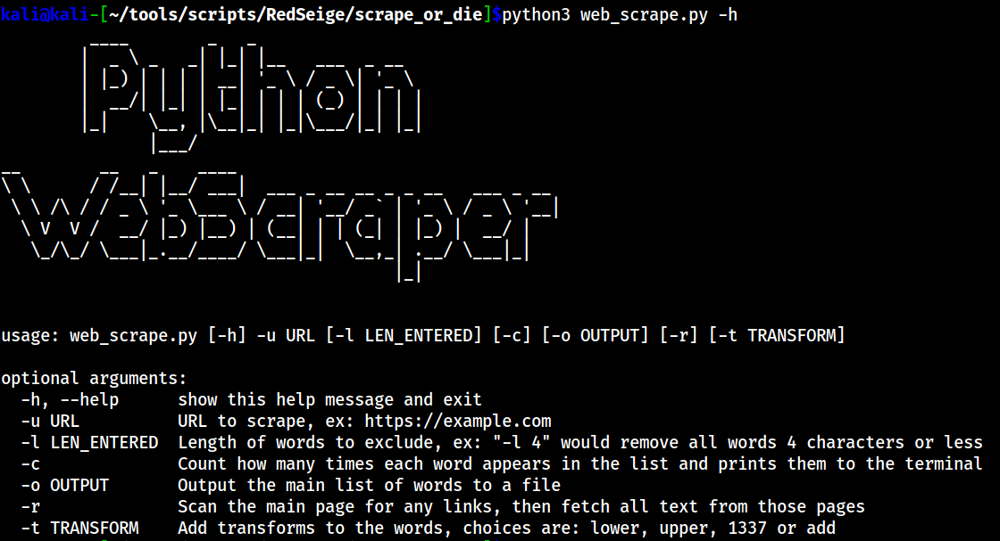
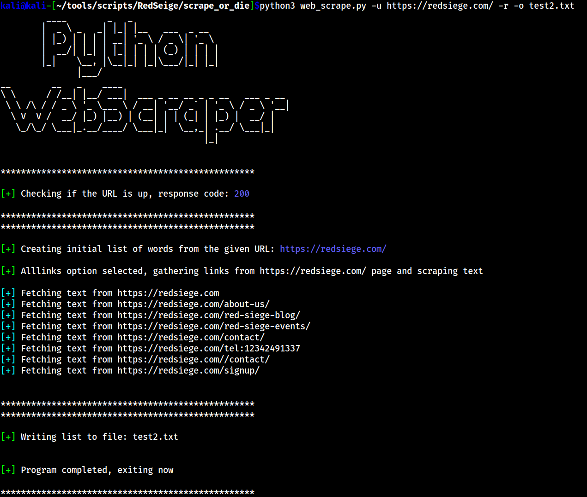

# README for Python WebScraper

This program was built to scrape the text from the URL provided, create a list of words and output them to a file. There are options to search for links and scrape all pages found, add transformations to the list, output a list of words with how many times they appear and to limit the words found by a fixed length.


## Help



## Examples



```sh
#Alllinks, output to file and count words
python3 web_scrape.py -u URL -a -o test2.txt -c

#Alllinks, output to file and filter out words 4 letters or less
python3 web_scrape.py -u URL -a -o test2.txt -l 4

#Alllinks, output to file and transform 'add'
#Transform options are add, lower, upper, 1337 and cap
#Values for 1337 can be easily changed in the script
python3 web_scrape.py -u URL -a -o test2.txt -t add

```
